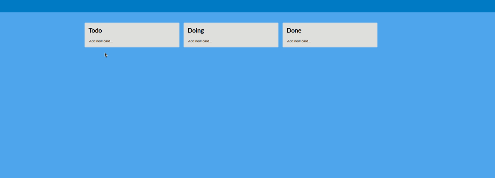

# Kanban App
  
A simple drag and drop kanban implemented with React  
Uses [React DnD](https://react-dnd.github.io/react-dnd/about)

## Building

After cloning the repository for the first time, run `npm install`.  

To build and run the project run `npm start`. This will run a local server as well as watch for changes to the source files and automatically rebuild.

Navigate to `locahost:3000` in the browser to see the project.